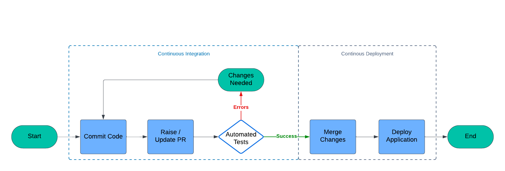

# sample-fargate-webapp

Sample web app deployed as container on AWS via the Fargate service using Terraform.

## High Level Design


Approved changes made to the application's source code trigger generation of a new
docker container image stored in Elastic Container Registry.
The latest image is then deployed as a Fargate task.
End users can access the application by using a DNS record pointing to the
Application Load Balancer deployed to route traffic to the Fargate task.

## Process Workflow



Each time a developer commits code to the repo the CI process is triggered and
runs a number of automated tests to make sure everything is ok with the changes.
If errors occur the developer must fix it with new commits.
If everything is ok PR can be opened to merge the changes into the main branch.
Once the PR is merged the CD process triggers to deploy new version of the app.

## Areas of Improvement

* The infrastructure part of the code can be moved to a separate git repo so that
this repo is only for the application's source code. 
* There is probably better implementation of the services. For example the ECR registry
should have policy and lifecycle set. Since we are emphasizing on the CI/CD process here
things are kept rather simple.
* The CI/CD process can be improved to one of the following:
  * everything can be moved inside AWS for seamless integration
  * if still using Github actions the AWS credentials can be done via OIDC provider  
  instead of using programmatic access via key.
  * The CI tests can be bundled in a container so that they are maintained centrally
  outside the scope of this app repo.

## Requirements

* AWS account
* Secret / access Key pair for authentication as an IAM user
* That IAM user should have sufficient permissions to deploy the infrastructure
* Configured `tfbackend` file for the terraform code (so S3 bucket already created)
* ECR Repo to store the container images

### Examples for the required files:

#### s3.tfbackend

```hcl
bucket = "my-unique-random-bucket-name"
key = "sample-fargate-webapp/terraform.tfstate"
region = "eu-west-1"
```

#### input.auto.tfvars

```hcl
region = "eu-west-1"
env = "staging"
```

## Repo Structure

### application

The application folder contains:

* the actual app code that will be packaged in the container
* the requirements / dependencies needed
* the Dockerfile for the image creation

### images

The Lucid diagrams used in the README.

### infrastructure

Contains the terraform code that creates the required AWS infrastructure 
for the app to be deployed in.

## How-To Deploy Manually

1. `cd infrastructure`
2. Assume role with sufficient permissions
3. Adjust the `tfbackend` and `tfvars` files to work for you (i.e. change the bucket name)
4. `terraform init -backend-config=s3.tfbackend && terraform apply`